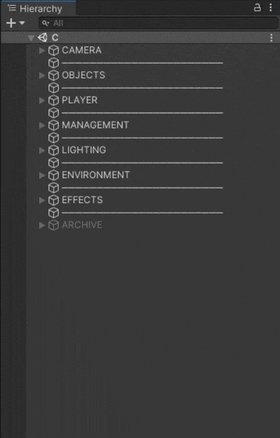

# Hierarchy Tree for Unity

> 🧪 **EXPERIMENTAL** This experimental project is still under development, so it may be unstable. It is not optimized and is largely untested. Do **not** use this project in critical projects.

This package renders a tree view in Unity's hierarchy window. Just add it to your project as described below, and that's all – no further steps required.

<p align=center>
    <br>
    <br>
    <a href="./README.md">
        
    </a>
    <br>
    <br>
    <br>
</p>

## Install the Package

I recommend **installing this package from a Git URL using the Package Manager window.** This involves the following steps:

1. Open the Package Manager window in your Unity editor (Window ➜ Package Manager)
2. Click "+" in the upper left corner ➜ "Add package from git URL" 
3. Enter the Git URL of the latest release: ```https://github.com/dyrdadev/hierarchy-tree-for-unity.git#0.2.1``` and click "Add"

> You can find more information [here](https://docs.unity3d.com/Manual/upm-ui-giturl.html).

## Customization
The tree can be customized or disabled under `Edit > Preferences... > Hierarchy > Hierarchy Tree`.

## License

This package is licensed under an MIT license. See the [LICENSE](/LICENSE.md) file for details. 

## Contribute

This project was created by [Daniel Dyrda](https://dyrda.page).

> Daniel: _If you want to support me and my projects, you can follow me on [GitHub (DyrdaDev)](https://github.com/DyrdaDev) and [Mastodon](https://dyrda.page/contact). Just come by and say hello, I would love to hear how you are using these assets in a project._

If you want to contribute to this project, you are welcome to do so. Just write to me and we will find a way to collaborate.
